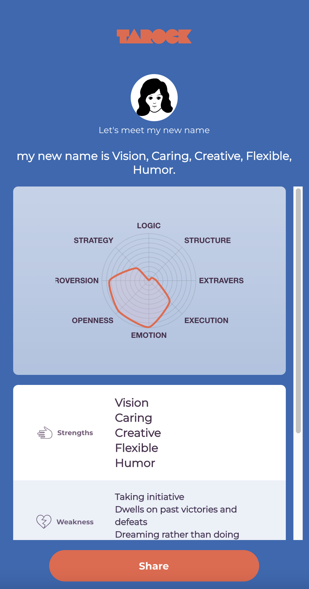

# TarockWebTest

This is a sample code from Tarock web application. The code is not compilable.

MyCardScreen demonstrates the following screen:

CommonCard is a sub component that is used in MyCardScreen.

Please follow the instructions below to make your changes regarding code logic/bugs/code styles/improvements, etc. You can simply imagine that if you are implementing this page, what would you do? You can either directly make changes to code or add comments to code.

This test requires knowledge of React and Bootstrap.

1. Login to your personal Github account
2. Fork this repository
3. Clone your forked repository to local, make changes, commit changes, push to forked Github repository
4. Create a pull request to this repository

Any questions, please contact zane@tarock.me or wechat.

Cheers!
